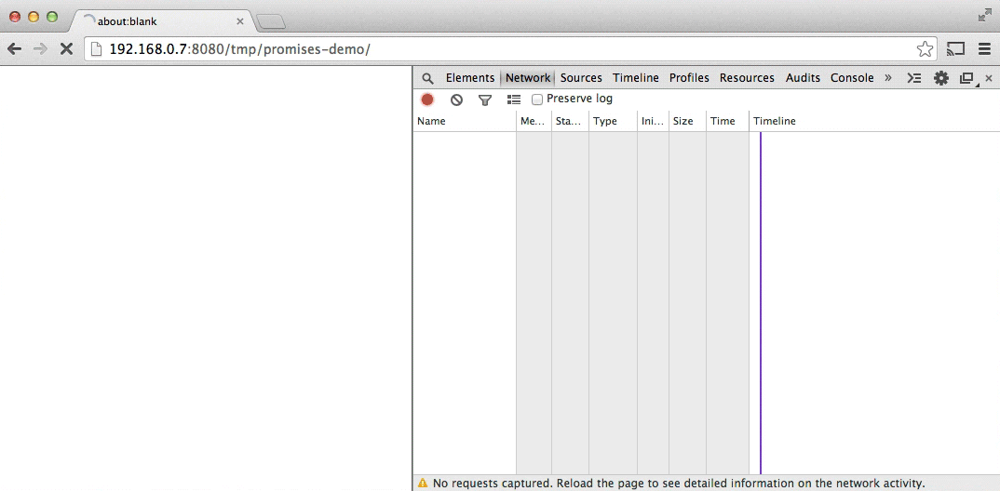
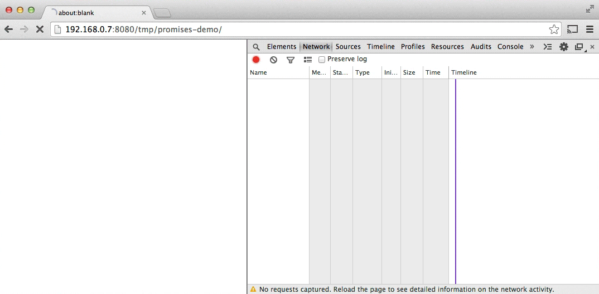
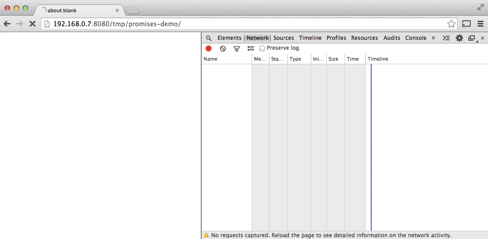

# Promises

> **JavaScript is single threaded**, meaning that two bits of script cannot run at the same time; they have to run one after another. In browsers, JavaScript shares a thread with a load of other stuff that differs from browser to browser. But typically JavaScript is in the same queue as painting, updating styles, and handling user actions \(such as highlighting text and interacting with form controls\). Activity in one of these things delays the others.

> At their most basic, promises are a bit like event listeners except:
>
> * A promise can only succeed or fail once. It cannot succeed or fail twice, neither can it switch from success to failure or vice versa.
> * If a promise has succeeded or failed and you later add a success/failure callback, the correct callback will be called, even though the event took place earlier.
>
> This is extremely useful for async success/failure, because you're less interested in the exact time something became available, and more interested in reacting to the outcome.

## Promise Terminology

A promise can be:

* **fullfilled** - The action relating to the promise succeeded
* **rejected** - The action relating to the promise failed
* **pending** - Hasn't fulfilled or rejected yet
* **settled** - Has fulfilled or rejected

An object that is promise-like is **thenable**.

## Promise basic usage

### Way of creating a promise

```javascript
var promise = new Promise(function(resolve, reject) {
    // do a thing, possibly async, then...
    if ( /* everything turned out fine */) {
        resolve("Stuff worked!");
    } else {
        reject(Error("It broke"));
        // It's customary, but not required, to reject with an Error object.
        // The benefit of Error objects is they capture a stack trace,
        // making debugging tools more helpful.
    }
)
```

The promise constructor takes one argument, a callback with two parameters, resolve and reject. Do something with the callback, perhaps async, then call resolve if everything worked, otherwise reject.

**Code in the promise is executed immediately when the promise is created.**

### Way of using promise

```javascript
promise.then(function(result) {
    console.log(result); // Stuff worked!
}, function(err) {
    console.log(errr); // Error: "It broke"
})
```

`then()` takes two arguments, a callback for a success case, and another for the failure case. Both are optional.

> All new DOM APIs with async success / failure methods will use promises.

### Prose Example

Task:

1. Start a spinner to indicate loading
2. Fetch some JSON for a story, which gives us the title, and urls for each chapter
3. Add title to the page
4. Fetch each chapter
5. Add the story to the page
6. Stop the spinner
7. \(Also tell the use if something went wrong along the way\)

#### Promisifying XMLHttpRequest

```javascript
function get(url) {
  // Return a new promise.
  return new Promise(function(resolve, reject) {
    // Do the usual XHR stuff
    var req = new XMLHttpRequest();
    req.open('GET', url);

    req.onload = function() {
      // This is called even on 404 etc
      // so check the status
      if (req.status == 200) {
        // Resolve the promise with the response text
        resolve(req.response);
      }
      else {
        // Otherwise reject with the status text
        // which will hopefully be a meaningful error
        reject(Error(req.statusText));
      }
    };

    // Handle network errors
    req.onerror = function() {
      reject(Error("Network Error"));
    };

    // Make the request
    req.send();
  });
}

get('story.json').then(function(response) {
  console.log("Success!", response);
}, function(error) {
  console.error("Failed!", error);
})
```

## Chaining promise

A promise can be chained by multiple `then()` to transform values or run additional async actions one after another.

### Transforming values

```javascript
get('story.json').then(function(response) {
  return JSON.parse(response);
}).then(function(response) {
  console.log("Yey JSON!", response);
})

// Since JSON.parse() takes a single argument and returns a transformed value,
// we can make a shortcut
get('story.json').then(JSON.parse).then(function(response) {
  console.log("Yey JSON!", response);
})

// Make a getJson() really easily
function getJSON(url) {
  return get(url).then(JSON.parse);
}
```

`getJSON()`  **still returns a promise**, one that fetches a url then parses the response as JSON.

### Queuing asynchronous actions

* If return a value from a `then()` callback, the next `then()` is called with that value.
* If return something promise-like, the next `then()` waits on it, and is only called when that promise settles \(succeds / fails\)

```javascript
getJSON('story.json').then(function(story) {
  return getJSON(story.chapterUrls[0]);
}).then(function(chapter1) {
  console.log("Got chapter 1!", chapter1);
})
```

Make a shortcut method to get chapters

```javascript
var storyPromise;

function getChapter(i) {
  storyPromise = storyPromise || getJSON('story.json');

  return storyPromise.then(function(story) {
    return getJSON(story.chapterUrls[i]);
  })
}

// and using it is simple:
getChapter(0).then(function(chapter) {
  console.log(chapter);
  return getChapter(1);
}).then(function(chapter) {
  console.log(chapter);
})
```

The `story.json` is not downloaded until `getChapter` is called, but the next time\(s\) `getChapter` is called, the story promise is reused, so `story.json` is only fetched once.

## Error handling

### **Rejection basics**

**Promise rejections skip forward to the next then\(\) with a rejection callback \(or catch\(\)\)**

**Also, Promise success skip forward to the next then\(\) with a success callback**

catch\(\) is sugar for then\(undefined, func\)

```javascript
// The following is the same
get('story.json').then(function(response) {
  console.log("Success!", response);
}).catch(function(error) {
  console.log("Failed!", error);
})

get('story.json').then(function(response) {
  console.log("Success!", response);
}).then(undefined, function(error) {
  console.log("Failed!", error);
})
```

A complex example

```javascript
asyncThing1()
  .then(// Only success callback, forward rejection to the next then()
    function() {
      return asyncThing2();
    })
  .then(// Only success callback, forward rejection to the next then()
    function() {
      return asyncThing3();
    })
  .catch(// Catch rejection from asyncThing1, asyncThing2 and asyncThing3
    function(err) {
      return asyncRecovery1();
    })
  .then(
    function() {// Success callback for asyncRecovery1
      return asyncThing4();
    },
    function(err) {// Rejection callback for asyncRecovery2
      return asyncRecovery2();
    })
  .catch(// Catch rejection from asyncThing4 and asyncRecovery2
    function(err) {
      console.log("Don't worry about it");
    })
  .then(function() {// Finally-like then()
    console.log("All done!");
  })
```


### Javascript exceptions and promises

Rejections happen when a promise is explicitly rejected, but also implicitly if an error is throw in the consructor callback. This means it's useful to do all the promise-related work inside the promise constructor callback, so **errors are automatically caught and become rejections.**

```javascript
var jsonPromise = new Promise(function(resolve, reject) {
  // JSON.parse throws an error if you feed it some
  // invalid JSON, so this implicitly rejects:
  resolve(JSON.parse("This ain't JSON"));
});

jsonPromise.then(function(data) {
  // This never happens:
  console.log("It worked!", data);
}).catch(function(err) {
  // Instead, this happens:
  console.log("It failed!", err);
  // error can be re-thrown after being caught
  throw err;
})

// As errors are turned into rejections,
// it can also be forwarded to the next then or catch
get('/').then(JSON.parse).then(function() {
  // This never happens, '/' is an HTML page, not JSON
  // so JSON.parse throws
  console.log("It worked!", data);
}).catch(function(err) {
  // Instead, this happens:
  console.log("It failed!", err);
})
```

## Summing up

### Getting story outline

```javascript
getJSON('story.json').then(function(story) {
  addHtmlToPage(story.heading);
  // TODO: for each url in story.chapterUrls, fetch & display
}).then(function() {
  // And we're all done!
  addTextToPage("All done");
}).catch(function(err) {
  // Catch any error that happened along the way
  addTextToPage("Argh, broken: " + err.message);
}).then(function() {
  // Always hide the spinner
  document.querySelector('.spinner').style.display = 'none';
})
```

### How to fetch chapters and show them in order?

> But how can we loop through the chapter urls and fetch them in order? This **doesn't work**:
>
> ```javascript
> story.chapterUrls.forEach(function(chapterUrl) {
>   // Fetch chapter
>   getJSON(chapterUrl).then(function(chapter) {
>     // and add it to the page
>     addHtmlToPage(chapter.html);
>   });
> })
> ```
>
> `forEach` isn't async-aware, so our chapters would appear in whatever order they download, which is basically how Pulp Fiction was written. This isn't Pulp Fiction, so let's fix it.

### Create a sequence to execute multiple async task in order

1. Create a promise that always resolves using `Promise.resolve()`
2. Loop through all the chapters and add `then()` to the tail of the current sequence.

```javascript
// Start off with a promise that always resolves
var sequence = Promise.resolve();

// Loop through our chapter urls
story.chapterUrls.forEach(function(chapterUrl) {
  // Add these actions to the end of the sequence
  sequence = sequence.then(function() {
    return getJSON(chapterUrl);
  }).then(function(chapter) {
    addHtmlToPage(chapter.html);
  });
})

// Use array.reduce to tidy up the code
// Loop through our chapter urls
story.chapterUrls.reduce(function(sequence, chapterUrl) {
  // Add these actions to the end of the sequence
  return sequence.then(function() {
    return getJSON(chapterUrl);
  }).then(function(chapter) {
    addHtmlToPage(chapter.html);
  });
}, Promise.resolve())
```

### Putting all together

```javascript
getJSON('story.json').then(function(story) {
  addHtmlToPage(story.heading);

  return story.chapterUrls.reduce(function(sequence, chapterUrl) {
    // Once the last chapter's promise is done…
    return sequence.then(function() {
      // …fetch the next chapter
      return getJSON(chapterUrl);
    }).then(function(chapter) {
      // and add it to the page
      addHtmlToPage(chapter.html);
    });
  }, Promise.resolve());
}).then(function() {
  // And we're all done!
  addTextToPage("All done");
}).catch(function(err) {
  // Catch any error that happened along the way
  addTextToPage("Argh, broken: " + err.message);
}).then(function() {
  // Always hide the spinner
  document.querySelector('.spinner').style.display = 'none';
})
```



Browsers are pretty good at downloading multiple things at once. The above code lost performance by downloading chapters one after the other.

### Using Promise.all to create a promise that fulfills when all the small promises get fulfilled

Promise.all takes an array of promises and creates a promise that fulfills when all of them successfully complete. The fulfill callback get an array of results in the same order as the promises passed in.

```javascript
getJSON('story.json').then(function(story) {
  addHtmlToPage(story.heading);

  // Take an array of promises and wait on them all
  return Promise.all(
    // Map our array of chapter urls to
    // an array of chapter json promises
    story.chapterUrls.map(getJSON)
  );
}).then(function(chapters) {
  // Now we have the chapters jsons in order! Loop through…
  chapters.forEach(function(chapter) {
    // …and add to the page
    addHtmlToPage(chapter.html);
  });
  addTextToPage("All done");
}).catch(function(err) {
  // catch any error that happened so far
  addTextToPage("Argh, broken: " + err.message);
}).then(function() {
  document.querySelector('.spinner').style.display = 'none';
})
```



### A better method for the task: Promise in Promise \(I called it\)

```javascript
getJSON('story.json').then(function(story) {
  addHtmlToPage(story.heading);

  // Map our array of chapter urls to
  // an array of chapter json promises.
  // This makes sure they all download in parallel.
  return story.chapterUrls.map(getJSON)
    .reduce(function(sequence, chapterPromise) {
      // Use reduce to chain the promises together,
      // adding content to the page for each chapter
      return sequence.then(function() {
        // Wait for everything in the sequence so far,
        // then wait for this chapter to arrive.
        return chapterPromise;
      }).then(function(chapter) {
        addHtmlToPage(chapter.html);
      });
    }, Promise.resolve());
}).then(function() {
  addTextToPage("All done");
}).catch(function(err) {
  // catch any error that happened along the way
  addTextToPage("Argh, broken: " + err.message);
}).then(function() {
  document.querySelector('.spinner').style.display = 'none';
})
```

1. Create downloading promise for each chapter using map, the download task will be executed in parallel.
2. Use a promise sequence to check all the promise one by one and display the chapter one by one.



## [API reference](https://developers.google.com/web/fundamentals/primers/promises#promise-api-reference)

